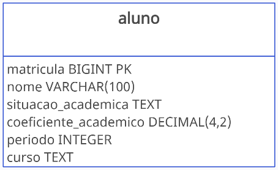
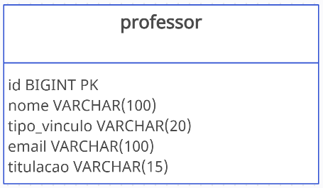
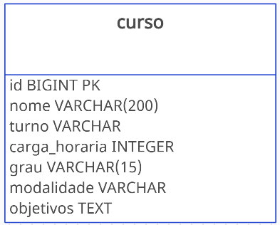

# Desafio - Sistema Acadêmico
Para a realização desse desafio foi utilizada as ferramentas para modelagem dos dados [Creately](https://app.creately.com/) e para a construção da base de dados foi utilizado o MySQL Workbench disponível para download nesse link [MYSQL](https://dev.mysql.com/downloads/).  

## Modelagem dos dados
Abaixo as imagens respectiva a modelagem, indicado os tipos de dados (colunas) associados a cada tabela.    

  
  

> [!NOTE]
> Um usuário root (administrador) normalmente fica responsável na criação, manutenção e gerenciamento das bases de dados, como também definir usuários e suas respectivas permissões.