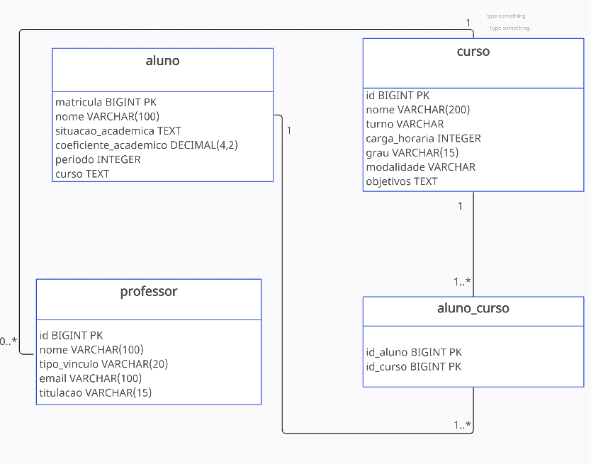

# Relacionamento de tabelas
Retornando ao sistema acadêmico surge o seguinte questionamento:  
> Qual tipo de relacionamento existe entre <ins>curso</ins> e <ins>professor</ins>?
> Onde criará a <ins>foreign key</ins>?
> Qual seria o tipo de relacionamento entre <ins>aluno</ins> e <ins>curso</ins>?
 
A resposta é que em um curso pode ter vários professores tornando uma relação nessa direção de **one-to-many** e na direção de professor para curso relação **many-to-one**, logo a chave estrangeira será criada na tabela professor referenciando a coluna <ins>id</ins> do curso.
 
Para as tabelas aluno e curso temos um relacionamento **many-to-many**, para isso foi criado uma tabela intermediária denominada <ins>aluno_curso</ins>.

  